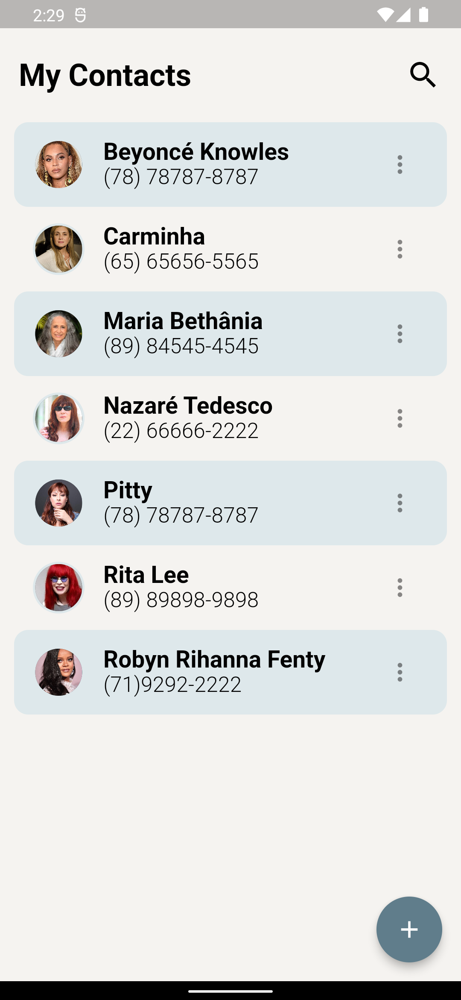

# ☎️ Lista de Contatos

## Sobre o projeto

O aplicativo efetua operações CRUD (Criar, Ler, Atualizar, Excluir) em relação aos contatos, mantendo as informações por meio do serviço. Isso possibilita aos utilizadores a criação de novos registros de contatos, a atualização de dados preexistentes e a remoção de entradas quando for apropriado.

## Screenshots

  
  

### Tecnologias utilizadas

- Flutter
- Bloc
- Back4App

### Desenvolvedora

<a href="https://www.linkedin.com/in/andremarques-dev/" > 
